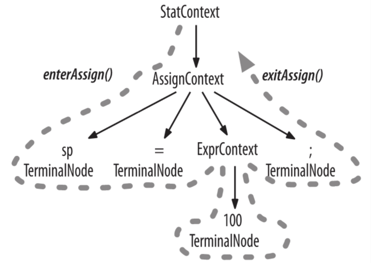

最近毕业设计有涉及到部分编译原理的内容，又要接触到词法、文法这些东西，因为是基于Java平台，就发现了ANTLR4这个非常好用的工具。其实它不仅可以生成Java目标代码，C++, Python都是可以的。非常后悔没有在上程序设计方法学和编译原理课程时发现它。

## 简介及安装

ANTLR4是一个非常强大的词法和语法生成器，采用递归下降的策略，和C的Bison和yacc的功能相似，也就是编译原理中学到的前端，但它相比其他前端是一个非常现代化的工具，这一点还是非常重要的，网上有丰富的资源可以来学习和借鉴。

[ANTLR4的官网](https://www.antlr.org/)

[Github](https://github.com/antlr)

同时ANTLR还有VSCode和Idea的插件，可以可视化的显示语法树，对于开发有很大的帮助。借用`ANTLR权威指南`作者的一句话：

> 为什么不花5天时间编程，来使你25年的生活自动化呢？

### 安装

这里只涉及Linux平台，Windows会稍有些麻烦，但在官网也都有：

```shell
cd /usr/local/libwget https://www.antlr.org/download/antlr-4.7.2-complete.jarexport CLASSPATH=".:/usr/local/lib/antlr-4.7.2-complete.jar:$CLASSPATH"alias antlr4='java -jar /usr/local/lib/antlr-4.7.2-complete.jar'alias grun='java org.antlr.v4.gui.TestRig'
```

然后在Terminal输入`antlr4`就会有版本等信息显示了。

插件则可以直接在VSCode内直接搜索或在Idea的plugin中搜索，也可以从官网直接下载。

## 基础语法

最推荐的学习方式是从官方的语法文件学习：

[Github语法Repo](https://github.com/antlr/grammars-v4)

仅列出部分比较关键的语法规则

- 小写字母开头的均代表语法规则
- 大写字母开头的均代表词法规则
- 词法与语法规则的编写顺序无关紧要
- 可以在某条产生式后方用`#lable`的方式添加标签，方便后续对listener或visitor的编写，但只要对其中一个产生式使用了标签，与它同级的所有产生式均需使用标签
- `|*?()`等符号的使用均可参考正则表达式
- 可以使用`fragment`来对部分需要在不同地方频繁使用但又不需要单独解析的词法进行修饰

### 计算器实例

以下是来自`ANTLR权威指南`的构建一个四则运算计算器的.g4文件供参考：

```java
grammar LabeledExpr; // rename to distinguish from Expr.g4

prog:   stat+ ;

stat:   expr NEWLINE                # printExpr
    |   ID '=' expr NEWLINE         # assign
    |   NEWLINE                     # blank
    ;

expr:   expr op=('*'|'/') expr      # MulDiv
    |   expr op=('+'|'-') expr      # AddSub
    |   INT                         # int
    |   ID                          # id
    |   '(' expr ')'                # parens
    ;

MUL :   '*' ; // assigns token name to '*' used above in grammar
DIV :   '/' ;
ADD :   '+' ;
SUB :   '-' ;
ID  :   [a-zA-Z]+ ;      // match identifiers
INT :   [0-9]+ ;         // match integers
NEWLINE:'\r'? '\n' ;     // return newlines to parser (is end-statement signal)
WS  :   [ \t]+ -> skip ; // toss out whitespace
```

这里强烈推荐使用Idea搭配ANTLR4插件或者VSCode搭配ANTLR4拓展使用，会有直观的可视化界面。

这是Idea的界面


这是VSCode的界面


## 语法分析

为了编写一个语言类应用，我们必须对每个输入的词组或者子词组执行一些适当的操作，即语义动作。最简单的方式就是操作语法分析器自动生成的语法分析树。这样我们就可以回到熟悉的Java领域，构建一个完整的语言类应用。

ANTLR运行库提供两种遍历树的机制。默认情况下，ANTLR使用内建的遍历器访问生成的语法分析树，并为每个遍历可能触发的事件生成一个语法分析树监听器接口(parse-tree listener interface)。一个监听器的方法实际上就是回调函数。除了监听器的方式之外，还有一个访问者模式(visitor pattern)。

### 语法分析树监听器

ANTLR运行库提供了ParseTree-Walker类，我们可以自行实现ParseTreeListener接口，填充自己的逻辑代码。

ANTLR为每个语法文件生成一个ParseTreeListener的子类，在该类中，语法中的每条规则都有对应的enter方法和exit方法。例如当遍历器访问到assign规则对应的节点时，它会调用enterAssign()方法，然后将对应的语法分析树节点–AssignContext的实例–当作参数传递给它。在遍历器访问了assign节点的全部子节点之后，它会调用exitAssign()。下面是对语法分析树进行深度优先便利的过程图。



下图是ParseTreeWalker对监听器方法的完整的调用顺序。


我们可以用监听器的方式来实现之前所说的计算器的功能。

```Java
public class Evaluator extends CalcBaseListener {
    public Map<String, Double> vars = new HashMap<>();
    public ParseTreeProperty<Double> values = new ParseTreeProperty<>();

    // stmt : ID '=' expr NEWLINE ;
    @Override
    public void exitAssign(CalcParser.AssignContext ctx) {
        String id = ctx.ID().getText();
        Double val = values.get(ctx.expr());
        vars.put(id, val);
    }

    // stmt : expr NEWLINE ;
    @Override
    public void exitPrintExpr(CalcParser.PrintExprContext ctx) {
        System.out.println(values.get(ctx.expr()));
    }

    // expr : NUMBER ;
    @Override
    public void exitLiteral(CalcParser.LiteralContext ctx) {
        values.put(ctx, Double.valueOf(ctx.NUMBER().getText()));
    }

    // expr : ID ;
    @Override
    public void exitId(CalcParser.IdContext ctx) {
        values.put(ctx, vars.containsKey(ctx.ID().getText()) ? vars.get(ctx.ID().getText()) : .0);
    }

    // expr : expr op=('*'|'/') expr ;
    @Override
    public void exitMulDiv(CalcParser.MulDivContext ctx) {
        double lhs = values.get(ctx.expr(0));
        double rhs = values.get(ctx.expr(1));
        values.put(ctx, ctx.op.getType() == CalcParser.MUL ? lhs * rhs : lhs / rhs);
    }

    // expr : expr op=('+'|'-') expr ;
    @Override
    public void exitAddSub(CalcParser.AddSubContext ctx) {
        double lhs = values.get(ctx.expr(0));
        double rhs = values.get(ctx.expr(1));
        values.put(ctx, ctx.op.getType() == CalcParser.ADD ? lhs + rhs : lhs - rhs);
    }

    // expr : '(' expr ')' ;
    @Override
    public void exitParen(CalcParser.ParenContext ctx) {
        values.put(ctx, values.get(ctx.expr()));
    }
}
```

### 语法分析树访问器(Visitor)

Visitor似乎是在ANTLR4之前使用的比较多，但从ANTLR4以来，官方似乎更偏向于使用Listener了。我们可以在命令行中加入-visitor选项使ANTLR为每一个语法生成访问器接口，语法中的每条规则对应接口中的一个visit方法。下图是常见的访问者模式对我们的语法分析树进行操作的过程。


Visitor模式会相比较而言更容易上手一些，感兴趣的话可以去了解设计模式相关的内容会更加有帮助一些。

同样是实现计算器，我们可以看看Visitor是怎么实现的。

```java
public class EvalVisitor extends LabeledExprBaseVisitor<Integer> {
    /** "memory" for our calculator; variable/value pairs go here */
    Map<String, Integer> memory = new HashMap<String, Integer>();

    /** ID '=' expr NEWLINE */
    @Override
    public Integer visitAssign(LabeledExprParser.AssignContext ctx) {
        String id = ctx.ID().getText();  // id is left-hand side of '='
        int value = visit(ctx.expr());   // compute value of expression on right
        memory.put(id, value);           // store it in our memory
        return value;
    }

    /** expr NEWLINE */
    @Override
    public Integer visitPrintExpr(LabeledExprParser.PrintExprContext ctx) {
        Integer value = visit(ctx.expr()); // evaluate the expr child
        System.out.println(value);         // print the result
        return 0;                          // return dummy value
    }

    /** INT */
    @Override
    public Integer visitInt(LabeledExprParser.IntContext ctx) {
        return Integer.valueOf(ctx.INT().getText());
    }

    /** ID */
    @Override
    public Integer visitId(LabeledExprParser.IdContext ctx) {
        String id = ctx.ID().getText();
        if ( memory.containsKey(id) ) return memory.get(id);
        return 0;
    }

    /** expr op=('*'|'/') expr */
    @Override
    public Integer visitMulDiv(LabeledExprParser.MulDivContext ctx) {
        int left = visit(ctx.expr(0));  // get value of left subexpression
        int right = visit(ctx.expr(1)); // get value of right subexpression
        if ( ctx.op.getType() == LabeledExprParser.MUL ) return left * right;
        return left / right; // must be DIV
    }

    /** expr op=('+'|'-') expr */
    @Override
    public Integer visitAddSub(LabeledExprParser.AddSubContext ctx) {
        int left = visit(ctx.expr(0));  // get value of left subexpression
        int right = visit(ctx.expr(1)); // get value of right subexpression
        if ( ctx.op.getType() == LabeledExprParser.ADD ) return left + right;
        return left - right; // must be SUB
    }

    /** '(' expr ')' */
    @Override
    public Integer visitParens(LabeledExprParser.ParensContext ctx) {
        return visit(ctx.expr()); // return child expr's value
    }
}
```

## 高级特性

目前我涉及到的高级特性主要就是将词法符号送入不同的通道。比如在多数情况下，我们的语言中的注释可以直接忽略无视，即不需要对其进行处理，所以我们可以看到如下的语法规则：

```
Comment : ( '//' ~[\r\n]* | '/*' .*? '*/' ) -> skip ;
```


可以看到`->skip`符号即代表抛弃了Comment所代表的词法符号。但有些时候我们需要这些注释的内容做些事情，这时如果我们将注释作为一个正常的词法符号来看待就会产生一些问题：即注释可以出现在几乎任何地方，这以为着我们需要修改许多文法规则，所以这显然是不好的方法。所以ANTLR4提供了将这些内容送入另一个通道的功能，就类似于广播的不同频段。但是`ANTLR权威指南`一书中的版本稍显过时，使用它的范例会出现报错，目前找到的合适的语法可参考：

https://github.com/blindpirate/the-definitive-antlr4-reference-code/tree/master/lexmagic

词法和语法是分开在两个文件中的，如何合并到一起我也正在研究。

## 总结

我主要的目的还是介绍以及推荐ANTLR这一强大的工具，对于接触过编译原理相关知识或是使用过其他编译前端工具的同学，ANTLR非常的容易上手，没接触过的也可以借助这一工具发现一片全新天地。本文主要参考`ANTLR权威指南`一书以及ANTLR官方文档，也参考了这篇：[Lequn Chen的ANTLR4博文](https://abcdabcd987.com/notes-on-antlr4/)。这篇博文在初期也给予了我极大的帮助。