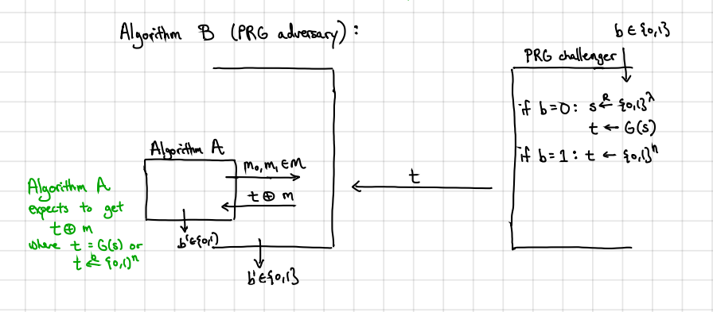
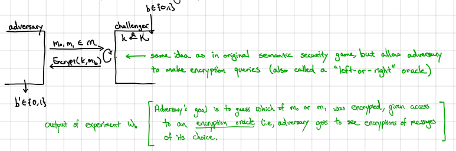
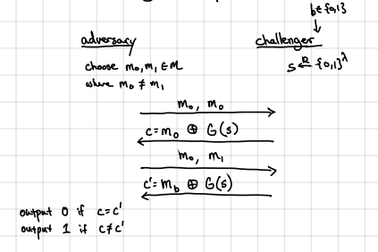

本篇博文参考了David Wu的[Introduction to Cryptography笔记](https://www.cs.virginia.edu/dwu4/courses/sp20/syllabus.html)以及[A Graduate Course in Applied Cryptography](https://toc.cryptobook.us/book.pdf)即Stanford密码学课程教材。 这些资源在网上都可以轻易得到，对于想要系统了解密码学的同学务必亲自去阅读一下，其中Stanford的CS255课程在Coursera甚至B站上也是可以免费听的。我在这篇博文中尽力用自己的方式进行理解和翻译，如有不严谨或者错误的地方，烦请指出，不胜感激！
## Overview
Cipher定义： ($K$, $M$, $C$)，其中$K$是key-space，$M$是message-space，$C$是cyphertext-space。并且包含了`Encrypt`, `Decrypt`即加密与解密算法。

Encrypt: $K$ x $M$ -> $C$

Decrypt: $K$ x $C$ -> $M$

两个算法必须`efficiently-computable`即多项式时间内完成。

正确性：
${\forall}$ $k$ ${\in}$ $K$, ${\forall}$ $m$ ${\in}$ $M$: Decrypt($k$, Encrypt($k$, $m$)) = $m$

One-time pad:

$K$ = {0,1}$^{n}$, $M$ = {0,1}$^{n}$, $C$ = {0,1}$^{n}$

Encrypt($k$, $m$): $c$ = $k$ ${\oplus}$ $m$

Decrypt($k$, $c$): $m$ = $k$ ${\oplus}$ $c$

Perfect secrecy定义：一个cipher(Encrypt, Decrypt)满足perfect secrecy如果对于所有的messages, $m0$,$m1$ ${\in}$ $M$, 所有的ciphertext $c$ ${\in}$ $C$:
$$ Pr[k \xleftarrow{R} K: Encrypt(k, m0) = c] = Pr[k \xleftarrow{R} K: Encrypt(k, m1) = c]$$ 

这里可以直观的理解为在key随机的情况下，不同的message加密成为同一个ciphertext的几率都是相同的。

而One-time Pad是符合Perfect secrecy的，证明不表。但因为One-time Pad需要至少和messages相同的长度，并不适合实际用来加密。所以我们需要一种更加可用的方式，根据香农定理，如果要实现perfect secrecy，$|K|$ ${\geq}$ $|M|$必须满足。所以我们需要将perfect secrecy这一条件放宽，转而限制住`computationally-bounded adversaries`即可。
因此我们可以通过一个较短的`seed`生成看起来随机的`key`。

## Stream cipher:
$K$ = {0,1}$^{\lambda}$, $M$ = {0,1}$^{n}$, $C$ = {0,1}$^{n}$

Encrypt($k$, $m$): $c$ = $G(k)$ ${\oplus}$ $m$

Decrypt($k$, $c$): $m$ = $G(k)$ ${\oplus}$ $c$

其中$n$ >> ${\lambda}$

因为此时已经不符合perfect secrecy的基本条件，所以我们需要一种新的security定义，做到没有efficient adversary可以分辨出PRG产生的key和实际完全随机的key。

我们需要两个实验，实验0由challenger通过PRG生成伪随机的t交给adversary来判断，实验1由challenger生成完全随机的t交给adversary来判断，而adversary输出0或1来表明是实验0还是实验1。设：
$$
W_0=Pr[adversary\;outputs\;1\;in\;Experiment\;0]\\
W_1=Pr[adversary\;outputs\;1\;in\;Experiment\;1]
$$
然后定义distinguishing advantage of A为
$$PRGAdv[A,G] = |W0-W1|$$

因此有定义：

如果对于所有的efficient adversaries A来说，$PRGAdv[A,G] = negl({\lambda})$，一个PRG是secure的

除了上述两个实验，我们还可以定义另外两个实验，adversary给challenger两个messages，$m_0$和$m_1$实验0对$m_0$进行加密，实验1对$m_1$进行加密，adversary则进行猜测，判断密文对应的明文是哪个，并输出0或1。
$$
W_0=Pr[b'=1 | b=0]\\
W_1=Pr[b'=1 | b=1]
$$
我们可以定义semantic security advantage为
$$
SSAdv[A,\pi_{se}] = |W_0-W_1|
$$

定义： 一个cipher $\pi_{se} = (Encrypt, Decrypt)$为semantically secure如果对于所有的efficient adversaries A来说， $SSAdv[A,\pi_{se}] = negl({\lambda})$

定理：如果一个cipher满足perfect secrecy，那么它也是semantically secure。

定理：G是一个secure PRG，那么G对应的sream cipher是semantically secure。

证明：考虑semantic secruity的两个实验

Experiment 0: Adversary选择$m_0$和$m_1$，并接受$c_0=G(s){\oplus}m_0$

Experiment 0: Adversary选择$m_0$和$m_1$，并接受$c_0=G(s){\oplus}m_1$

则：
$$
W_0=Pr[adversary\;outputs\;1\;in\;Experiment\;0]\\
W_1=Pr[adversary\;outputs\;1\;in\;Experiment\;1]
$$

如果G(s)是完全随机的string(one-time pad)那么$W_0=W_1$。但G(s)只能生成近似otp。定义：

Experiment 0‘’: Adversary选择$m_0$和$m_1$，并接受$c_0=t{\oplus}m_0$

Experiment 0: Adversary选择$m_0$和$m_1$，并接受$c_0=t{\oplus}m_1$

同样有对应的$W_0', W_1'$

我们可以得到$W_0'=W_1'$(因为otp是perfectly secure的)。根据secure PRG的定义，我们假设$|W_0-W_0'|=negl$和$|W_1-W_1'|=negl$

=>$|W_0-W_1| = |W_0-W_0'+W_0'-W_1'+W1'-W1| {\leq} |W_0-W0'| + |W0'-W1'| + |W1'-W1|
= negl + negl = negl$

那么只需证明G是secure PRG的情况下，对于所有的efficient adversary, $|W_0-W_0'|=negl$

这里我们可以利用reduction的方法进行证明，首先构造逆否命题，如果A可以分辨实验0和实验0‘，那么G不是一个secure PRG。

我们假设存在A可以分辨实验0和实验0'，那么我们可以构造B来break G的security。

我们只需在B中装入A，challenger和在定义secure PRG的实验中相同，我们将challenger生成的t与m进行异或交给B中的A，将A生成的结果输出就能打破PRG的security。可以参考这张图：

目前PRG是否存在仍是未知的，如果PRG存在，那么就证明了$P \neq NP$。教授上课提到了几种PRGs，例如Linear congruential generator, Linear feedback shift registers(LFSRs), content scrambling system(CSS)等，当然这些都已经被破解了。现代使用的Stream Ciphers主要是ChaCha。各位可以自行了解，此处不表。

## Block Cipher
即使stream cipher是安全的，那么有没有攻击的方法呢？自然是有的。在之前提到的Experiment中，adversay只能得到密文一次，并且key也只使用了一次。所以无法表明在多条明文/密文情况下的安全性。所以我们需要引入更加strong的定义。

### CPA-security
CPA即chosen-plaintext attacks, 选择明文攻击。同样的，我们通过experiment来给出CPA-security的定义。
定义： 一个encryption scheme $\pi_{se} = (Encrypt, Decrypt)$是CPA-secure的当对所有efficient adversaries A来说：
$$
CPAAdv[A,\pi_{se}] = |Pr[W_0 = 1 -Pr[W_1=1]|= negl.
$$
其中$W_b(b\in{0,1})$是下面这个试验的输出:

可以看到这个试验和semantic security game非常相似，即发给challenger $m_0$及$m_1$。而challenger则输出对$m_b$的加密结果，其中$b$是随机的。而adversary则要猜测b，并且可以多次发送query。

根据定义，我们可以证明stream cipher不是CPA-secure的。我们只需进行两次查询即可。

第一次adversary发送$m_0,m_0$，就会得到$c=m_0\oplus G(s)$，随后再发送$m_0,m_1$得到$c'=m_b\oplus G(s)$。因此我们只需在c=c'输出0反之输出1即可。

因此我们可以看出CPA-secure要求加密是随机的。这也是为什么我们需要block cipher的原因。Block cipher是基于密钥可逆的，将n bits的输入映射到n bits的输出上。

首先我们需要了解pseudorandom functions(PRFS)和pseudorandom permutations(PRPs)，PRFs的表现类似于随机函数，而PRPs则像随机排列。

#### 对CPA-security的进一步理解
最近一周是Cryptography的期中测试，是take home开卷形式的。第一题就是和CPA-security相关，让我对CPA-security有了更进一步的了解。题目的第一问就是让我们证明，当明文与密文的长度相同时，一个对称加密的scheme一定不是CPA-security的。

开始时并没有太多的思路，当然也是因为对于CPA-security的理解还不够深入。其实CPA-security的一个核心概念就是，deterministic的scheme，即确定性的scheme一定不是CPA-secure的。所以我们只需要证明在明文与密文的长度相同时，这个scheme是确定性的。对于任意一个固定的key，根据encryption scheme的正确性定义，从明文到密文的映射Encrypt(k,·)必定是injective，即单射的。这说明不可能有两个相同的明文映射到同一个密文上，这个并不理解，否则在解密时对于这个密文而言，我应该还原成哪个明文呢？而又因为domain和Encrypt(k,·)的范围是一样的，这就意味着Encrypt(k,·)同时也是bijection即双射的。这意味着一个明文必定映射到一个密文上。所以这是一个确定性的scheme，自然不可能是CPA-secure的。

而这个问题的第二问则是计算在密文的长度m大于明文的长度n时，且m-n=l时，如何break CPA-secure，其中l < n/2。对于这题，我们可以构造一个发送q次query请求的advasary，其中$q<2^n$。

1. 对于i = 1,...,q, 提交query $(0^n, i)$，然后challenger返回的结果为$ct_i$。
2. 如果存在$1 \leq i \neq j \leq q$使得$ct_i = ct_j$，adversary输出1，否则输出0。

然后我们可以计算一下上述adversary的advantage。当b=0时，意味着challenger是对$0^n$字符串加密。因为m-n=l，所以$ct_i$是在$2^l$上随机分布的密文。根据birthday bound的原理（即一个正常的班级中大概率有两个人生日相同），如果$q \geq 1.2\sqrt{2^l}$时，存在$ct_i = ct_j$的概率超过了1/2。而当b=1时，因为challenger每次加密的都是不同的明文，所以不存在$ct_i=ct_j$的情况，即概率为0。所以当$q \geq 1.2\sqrt{2^l}$，那么上述adversary的advantage至少为1/2。