## 要求

>用CubeMX配置一个echo程序，能初始化第一个串口，将串口收到的内容回复回去。
用W1配置的GNU交叉编译器编译，用W1配置的串口下载工具下载运行测试。
报告给出配置、编译、下载和运行的过程，并对CubeMX自动生成的代码做分析。

## CubeMX安装

直接进入STM32CubeMX工具的的[主页](https://my.st.com/content/my_st_com/zh/products/development-tools/software-development-tools/stm32-software-development-tools/stm32-configurators-and-code-generators/stm32cubemx.license%3d1521121862499.html#getsoftware-scroll)，所有系统的安装文件都在这列获取。

在注册完成后，单击获取软件即可开始下载：


然后将下载的zip文件解压，运行其中的.linux文件即可开始安装：

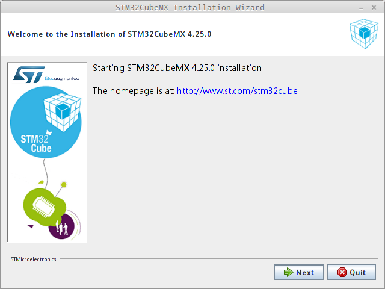

安装完成后直接打开：


## 新建并配置工程

点击New Project，找到我们的单片机：

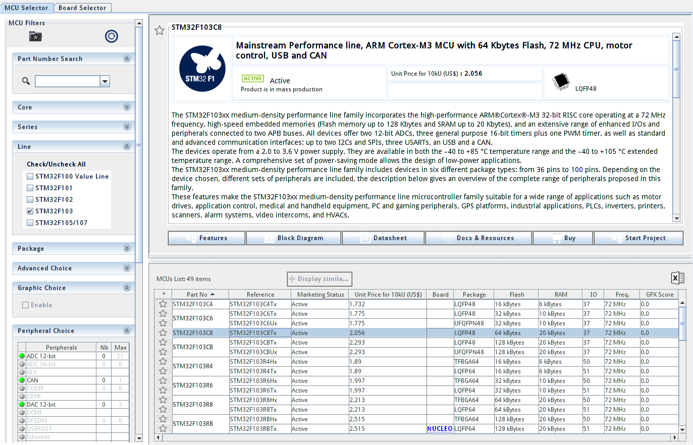

接着开始进行配置，我们首先在RCC处的High Speed Clock(HSE)选择Crystal/Ceamic Resonator


然后在USART1处选择Mode，调整为Asynchronous。


此时，在屏幕中间的芯片已经有了变化。然后我们

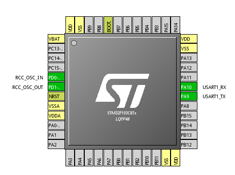

尽管我们的要实现的要求是能够echo串口收到的回复，但是为了让实现的效果更加明显，我们可以选择一个引脚来输出给灯泡，让灯泡发光。这里我们选择第一周助教代码中设置的A2引脚，在PA2上选择GPIO_Output即可。

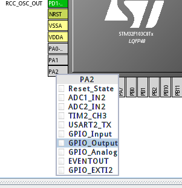

接着，我们在左上角选择Clock Configuration的标签，将PLL Source Mux选择为HSE,System Clock Mux选择为PLLCLK：

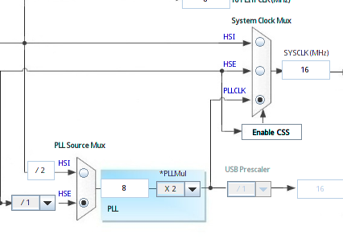

然后在左上角的Configuration标签继续设置，先点USART1:

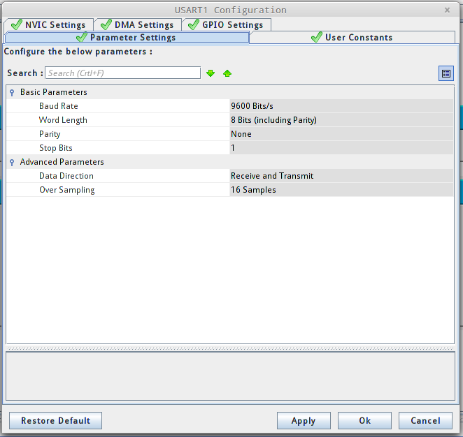

与第一周连接串口的设置保持相同，设置为9600 Bits/s,8N1即可。

然后选择GPIO，选择PA2，将Maximum output speed改为High即可：


最后，我们就可以导出工程，生成代码了，点击工具栏的"Generate source code based on user setting"，然后进行相关配置，在toolchain那里我们直接选择makefile:

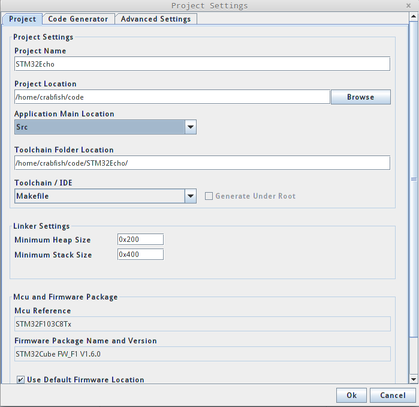

配置完成后就可以开始生成代码，因为我们还没有安装过cube库，所以他会自动开始下载：

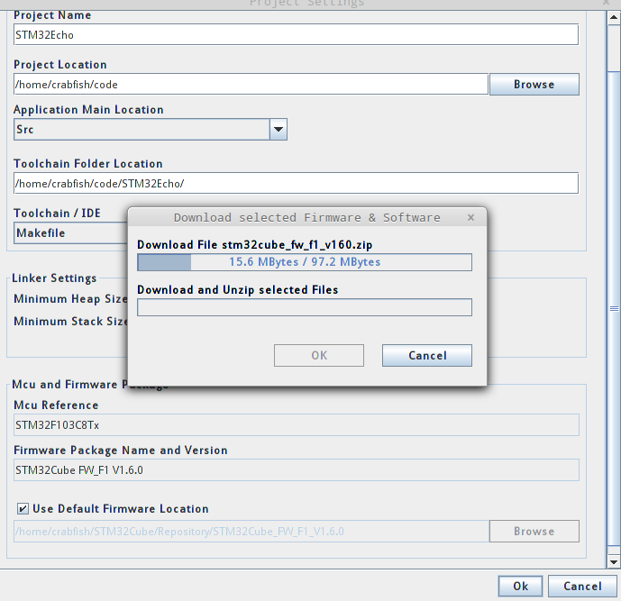

## 编译与运行

我们打开工程所在的目录，在目录中可以看到cubeMX已经为我们生成了Makefile文件。我们要做的就是编写main函数然后编译运行。

我们进入Src目录编辑main.c文件，可以看到cubeMX已经为我们注明了哪些部分的代码由用户来编写，类似于：

```C
  /* USER CODE BEGIN 1 */

  /* USER CODE END 1 */

  /* MCU Configuration----------------------------------------------------------*/

  /* Reset of all peripherals, Initializes the Flash interface and the Systick. */
  HAL_Init();

  /* USER CODE BEGIN Init */

  /* USER CODE END Init */

  /* Configure the system clock */
  SystemClock_Config();

  /* USER CODE BEGIN SysInit */

  /* USER CODE END SysInit */
  ```

为了实现灯泡点亮和echo功能，我们在main中开始编写。我写了一个输出一行信息的函数：
```C
void uartPrintln(UART_HandleTypeDef *huart, char _out[]){
  HAL_UART_Transmit(huart, (uint8_t *) _out, strlen(_out), 0xffff);
  char newline[2] = "\r\n";
  HAL_UART_Transmit(huart, (uint8_t *) newline, 2, 0xffff);
} 
```
然后在进入while循环前将灯泡点亮并输出欢迎信息：
```C
  uartPrintln(&huart1, "Hello World!");
  HAL_GPIO_WritePin(GPIOA,GPIO_PIN_2, GPIO_PIN_SET);
  char in[2];
```
然后在while循环内实现echo:
```C
  while (1)
  {

  /* USER CODE END WHILE */
  
  /* USER CODE BEGIN 3 */
    HAL_UART_Receive(&huart1, (uint8_t *)in, 1, 0xffff);
    HAL_UART_Transmit(&huart1,(uint8_t *)in, 1, 0xffff);
  }
  /* USER CODE END 3 */
```
改写代码完成后就可以开始编译工作了。如果直接在目录下输入make肯定是会报错的，因为还没有在Makefile中给出编译工具链的目录，因此在BINPATH处填对应的目录即可：

```
#######################################
# binaries
#######################################
BINPATH = /usr/bin
PREFIX = arm-none-eabi-
CC = $(BINPATH)/$(PREFIX)gcc
AS = $(BINPATH)/$(PREFIX)gcc -x assembler-with-cpp
CP = $(BINPATH)/$(PREFIX)objcopy
AR = $(BINPATH)/$(PREFIX)ar
SZ = $(BINPATH)/$(PREFIX)size
HEX = $(CP) -O ihex
BIN = $(CP) -O binary -S
```

再次make，不出意外的话还是会报错。这是因为cubeMX在生成Makefile的时候会有Bug，源文件中会有重复的内容：

```
# C sources
C_SOURCES =  \
Drivers/STM32F1xx_HAL_Driver/Src/stm32f1xx_hal_gpio_ex.c \
Src/main.c \
Drivers/STM32F1xx_HAL_Driver/Src/stm32f1xx_hal_uart.c \
Src/stm32f1xx_hal_msp.c \
/Src/system_stm32f1xx.c \
Drivers/STM32F1xx_HAL_Driver/Src/stm32f1xx_hal_pwr.c \
Drivers/STM32F1xx_HAL_Driver/Src/stm32f1xx_hal_gpio.c \
Drivers/STM32F1xx_HAL_Driver/Src/stm32f1xx_hal_flash.c \
Drivers/STM32F1xx_HAL_Driver/Src/stm32f1xx_hal_tim.c \
Drivers/STM32F1xx_HAL_Driver/Src/stm32f1xx_hal.c \
Drivers/STM32F1xx_HAL_Driver/Src/stm32f1xx_hal_dma.c \
Drivers/STM32F1xx_HAL_Driver/Src/stm32f1xx_hal_tim_ex.c \
Drivers/STM32F1xx_HAL_Driver/Src/stm32f1xx_hal_cortex.c \
Drivers/STM32F1xx_HAL_Driver/Src/stm32f1xx_hal_rcc.c \
Drivers/STM32F1xx_HAL_Driver/Src/stm32f1xx_hal_rcc_ex.c \
Src/stm32f1xx_it.c \
Drivers/STM32F1xx_HAL_Driver/Src/stm32f1xx_hal_flash_ex.c
# Src/stm32f1xx_hal_msp.c
# Src/stm32f1xx_hal_msp.c# Src/main.c \
# Src/stm32f1xx_it.c  
```

其中我注释掉的内容就是重复的文件。

再次make，这回应该就能成功了。


所有生成的文件都在build目录下，我们可以按照上周的方法烧录并且测试了：

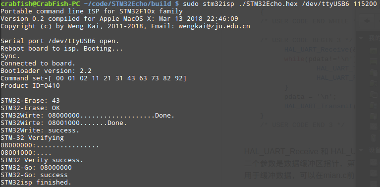

灯泡成功点亮：

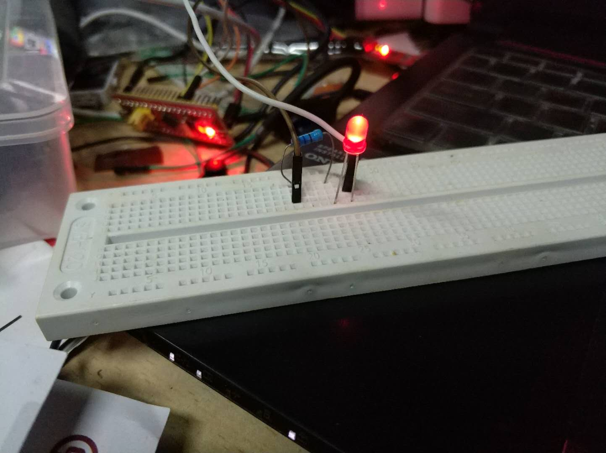

在minicom中测试：

欢迎信息：

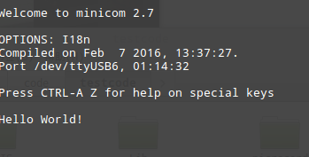

echo测试(在打开本地回显的情况下所有字符出现两次)：

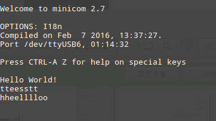

## CubeMX自动代码生成分析

目录中主要有三个文件夹：
* Drivers
* Inc
* Src

剩下的为project的配置文件，Makefile以及一个.ld文件--GNU的linker

### Drivers

Drivers中的文件应该就是我们在配置项目时下载的库的部分文件。因为在库的下载目录中我们也能找到Drivers文件夹，且许多文件相同。所以应该是CubeMX根据我们板子的具体型号拷贝过去的部分适配的库文件。

### Inc

这里装的是根据我们的配置生成的相关头文件。以stm32f1xx_hal_conf.h为例，我们在CubeMx中设置过的Uart和GPIO的enable宏都被取消了注释。

### Src

这里就是具体的代码了。比如main.c文件中就是我们主要编写的部分，里面模块分的非常清楚，非常仔细的点出了用户编写的代码应该放在哪些地方。

再有就是对于串口的设置也放在main.c中：

```C
/* USART1 init function */
static void MX_USART1_UART_Init(void)
{

  huart1.Instance = USART1;
  huart1.Init.BaudRate = 9600;
  huart1.Init.WordLength = UART_WORDLENGTH_8B;
  huart1.Init.StopBits = UART_STOPBITS_1;
  huart1.Init.Parity = UART_PARITY_NONE;
  huart1.Init.Mode = UART_MODE_TX_RX;
  huart1.Init.HwFlowCtl = UART_HWCONTROL_NONE;
  huart1.Init.OverSampling = UART_OVERSAMPLING_16;
  if (HAL_UART_Init(&huart1) != HAL_OK)
  {
    _Error_Handler(__FILE__, __LINE__);
  }

}
```

很多详细的设置也都可以看到。